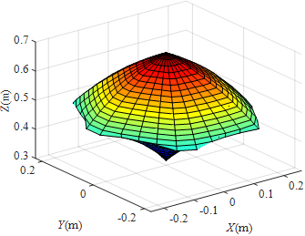
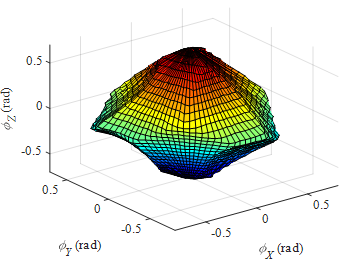
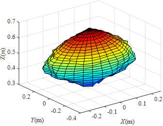
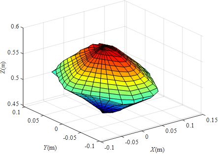
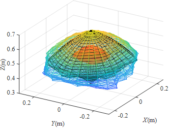

# Stewart-Platform-Related-Code

Stewart Platform Related Code，such as forward kinematics, inverse kinematics, inverse dynamics, workspace etc.

## Run code

run example_*.m file.

## Workspace pictures

#### Fixed Orentation - Location Workspace.

#### Fixed Location - Orentation Workspace.

#### Reachable Workspace.

#### All range orientation.

#### Comparison between all range, fixed orientation and reachable

From inside to outside.

